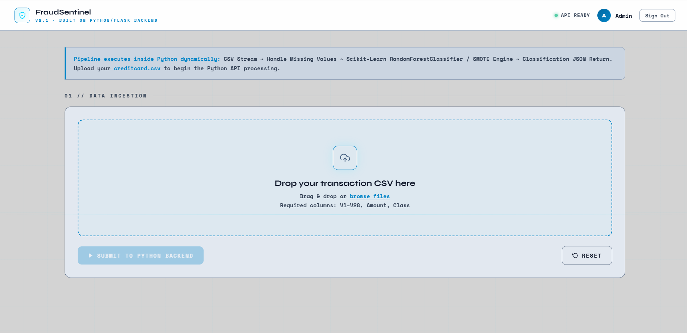
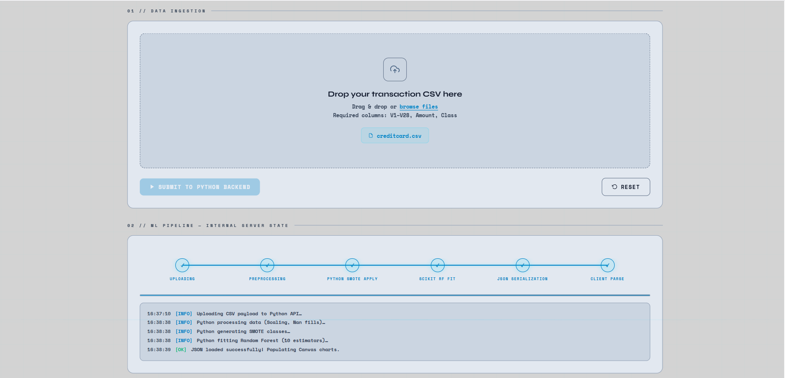
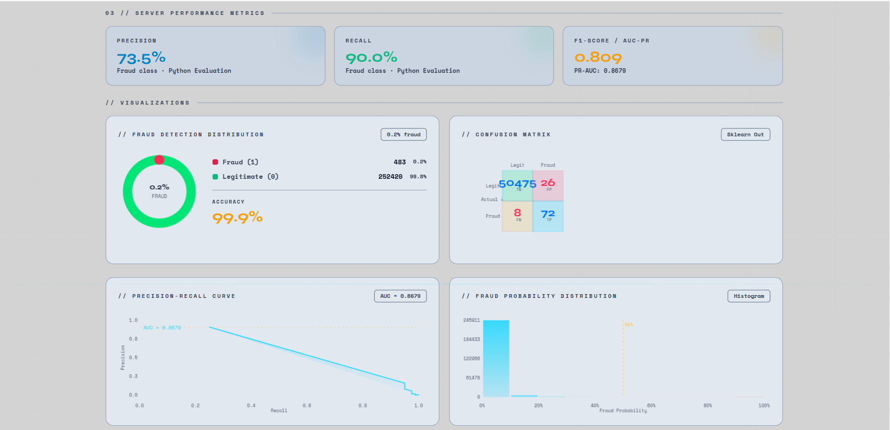
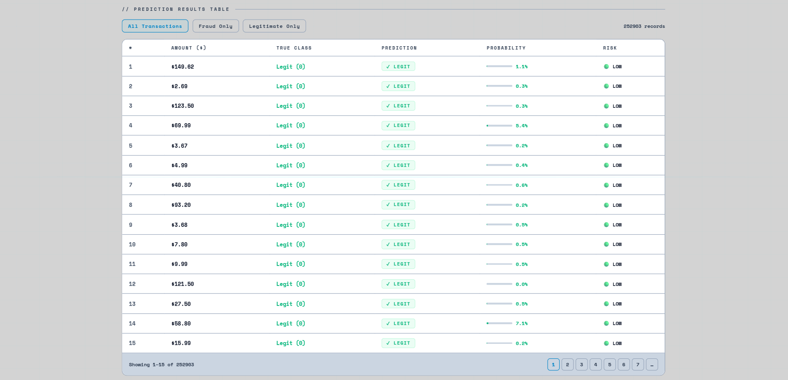
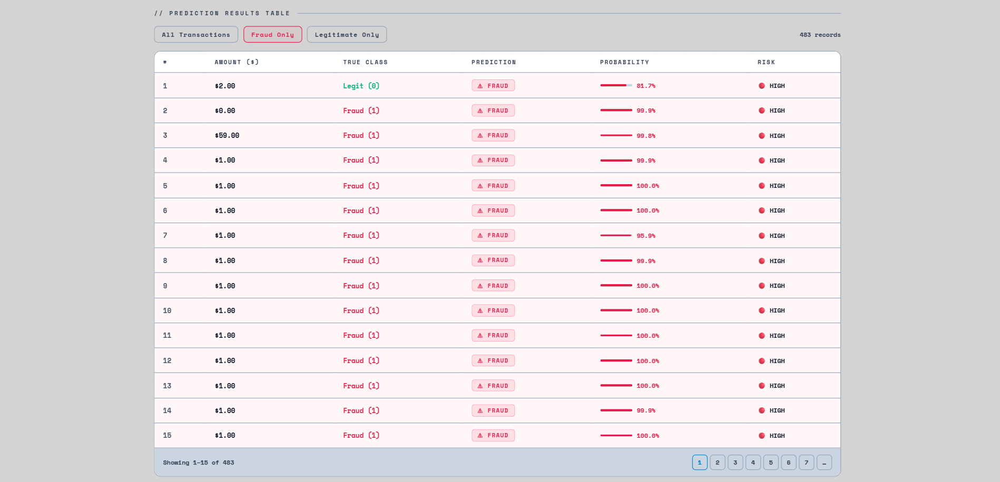
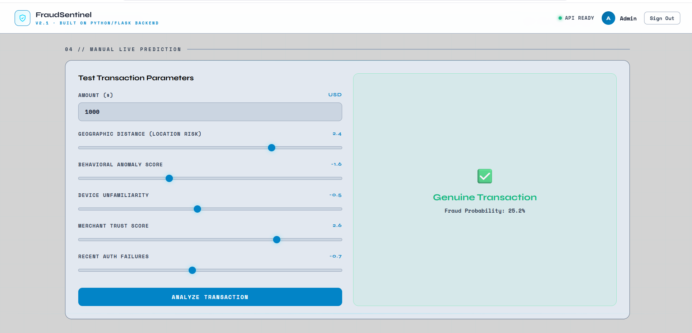
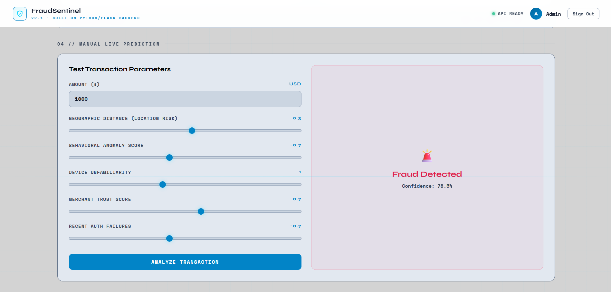
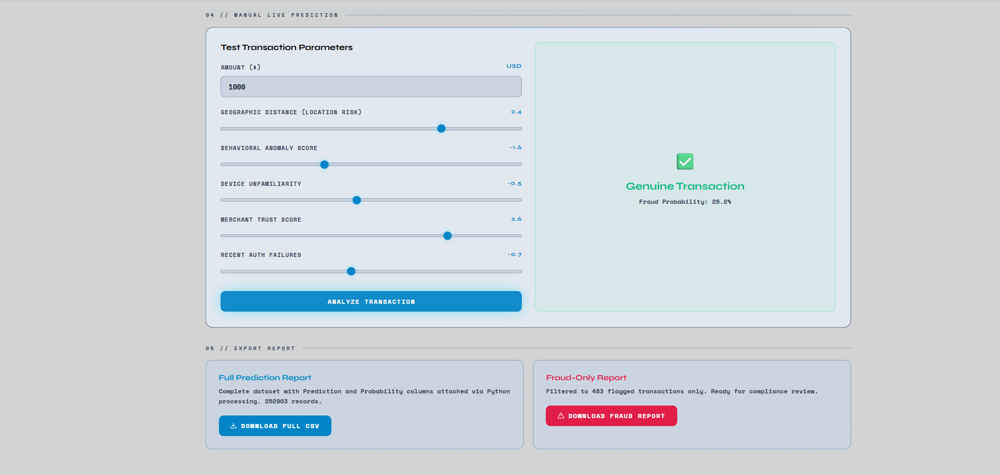

<div align="center">
  
# 🛡️ FraudSentinel ML Engine

[](https://www.python.org/)
[](https://flask.palletsprojects.com/)
[](https://scikit-learn.org/)
[](https://opensource.org/licenses/MIT)

**FraudSentinel ML Engine** is an end-to-end Machine Learning pipeline designed to detect fraudulent credit card transactions with high precision.

</div>

---

## 📖 Overview

FraudSentinel features a gorgeous, custom Single Page Application (SPA) dashboard built entirely in HTML, CSS, and Vanilla JavaScript. This frontend communicates seamlessly with a robust **Python Flask Web API**. The backend handles complex operations like IQR (Interquartile Range) noise reduction, SMOTE (Synthetic Minority Over-sampling Technique) for handling highly imbalanced data, and dynamic Scikit-Learn **Random Forest Classifier** model training every time a dataset is uploaded.

---

## ✨ Key Features

- **Full-Stack ML Pipeline:** End-to-end integration from raw CSV upload to interactive browser visualizations.
- **Advanced Preprocessing:** Automatic handling of highly imbalanced datasets using `imblearn`'s SMOTE algorithm.
- **Robust Outlier Removal:** Interquartile Range (IQR) boundary filtering to protect the model from noisy data.
- **Dynamic Training:** Trains a high-performance Random Forest Classifier on the fly based on the uploaded data.
- **High-Performance UI:** Vanilla JavaScript engine that asynchronously uploads massive datasets using `FormData` and streams results to native HTML5 `<canvas>` elements for stunning visual feedback.

---

## 📸 Application Gallery

### 1. Home Page & Dashboard Overview


### 2. Dataset Upload Pipeline


### 3. Model Performance Metrics


### 4. Transactions Overview
**All Transactions**


**Fraudulent Transactions**


### 5. Manual Live Predictions
**Legitimate Transaction Prediction**


**Fraudulent Transaction Prediction**


### 6. Automated Report Generation


---

## 🚀 Getting Started

### Prerequisites

- **Python**: Version 3.8 to 3.11 is recommended.
- **Dataset**: The official Kaggle dataset is required to process the data successfully.

### 1. Download the Dataset

This application is built to run on the Kaggle Credit Card Fraud dataset. 
1. Download it here: [Credit Card Fraud Detection Dataset (mlg-ulb/creditcardfraud)](https://www.kaggle.com/datasets/mlg-ulb/creditcardfraud)
2. Extract the downloaded ZIP file and ensure the file is named `creditcard.csv`.
3. Keep the file locally on your computer—you will upload it directly through the web interface. *(Do not add it to the repository as it exceeds GitHub's file size limits!)*

### 2. Installation

Clone this repository and install the required dependencies:

```bash
git clone https://github.com/shekhar2161/Credit-Card-Fraud-Detection.git
cd Credit-Card-Fraud-Detection
pip install -r requirements.txt
```

### 3. Running the Application

Start the Flask web server:

```bash
python app.py
```

Then, open your favorite modern web browser and navigate to:
**👉 `http://localhost:5000`**

---

## 🏗️ Architecture Overview

### Frontend
- **`templates/index.html`**: The main layout structure and UI scaffolding.
- **`static/css/style.css`**: Custom styling, design tokens, modern animations, and responsive grid layouts.
- **`static/js/script.js`**: Complex Vanilla JS engine. Handles UI interactions, data-viz rendering on `<canvas>`, and asynchronous large CSV chunk streaming to the backend API without freezing the main thread.

### Backend (`app.py`)
- Python Flask Server exposing the `/api/pipeline` REST endpoint.
- Protects the Random Forest with IQR boundary noise reduction mechanisms before applying data augmentation using **SMOTE**.
- Sends serialized precision/recall metrics back to the JavaScript UI to orchestrate visual outputs.

---

## 🤝 Contributing

Contributions, issues, and feature requests are welcome! Feel free to check the issues page.

## 📝 License

This project is open-source and available under the MIT License.
